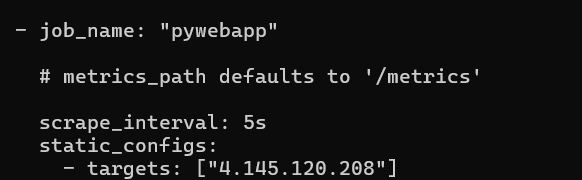

## Ansible Playbooks Provision the 

This Folder Contains the Ansible Scripts to Install and Configure Promethus server to Scrap metrics from the application

Below Documentation has been used to understand the installation and configuration of the promethus 

Manual Installation Steps 
https://prometheus.io/docs/introduction/first_steps/ 
https://www.linode.com/docs/guides/how-to-install-prometheus-and-grafana-on-ubuntu/

Configure Prometheus as Service 
https://sbcode.net/prometheus/prometheus-service/ 

Configure Prometheus to Scrap Metrics from a target
https://prometheus.io/docs/prometheus/latest/getting_started/ 

___Ansible Script Reference__

Purpose of the Playbooks as follows 

    install_promethus.yml  Install Promethus and Configure it as a service 
    configure_promethus.yml Configure Promethus Server to scrap metrics

Promethus does not have a package manager installation in summary following things needs to be done 
1. Download the Binary from Promethus Site
2. Extract it get Binary and Configuration file 
3. Copy executable to the /usr/local/bin location creating folder called prometheus in the path
4. Create the Service file , Start and Enable the service 

/usr/local/bin location alone with prometheus executable need to copy the prometheus.yml file. This the configuration file for the promethus.

In this file under scrap configs we have to add application to get the metric. Refer below Configuration Snippet.

It has been templated and deployed through prometheus.yml.j2 as below 

    - job_name: "pywebapp"
    # metrics_path defaults to '/metrics'
    scrape_interval: 5s
    static_configs:
      - targets: ["{{ static_IP }}"]

