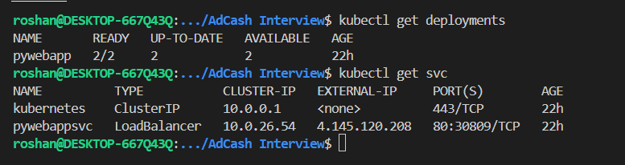

## Note about the Kubernetes Manifest
In the app_deployment.yml file contains deployment and service all in one manifest. 

It Deploys deployment with two replicas and Expose with Load Balancer Service 

AKS Cluster has default Load Balancer. Using that Load Balancer Application was exposed on port 80 with Static IP. Before Documentation specifies that 
    https://learn.microsoft.com/en-us/azure/aks/load-balancer-standard 

According Kubernetes Documentation if the Environemt Supports Cloud Load Balancer it provides External IP address. Refer below Docs
    https://kubernetes.io/docs/tasks/access-application-cluster/create-external-load-balancer/ 

Refer below output show deployment and Service 

As shown in the main page Application Acessible from the External IP. This IP is not change in terms of cluster reboots