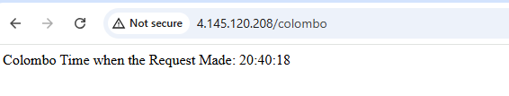
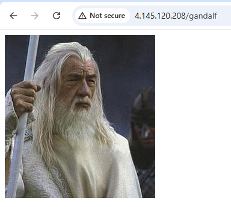
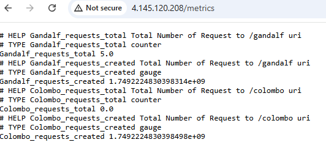
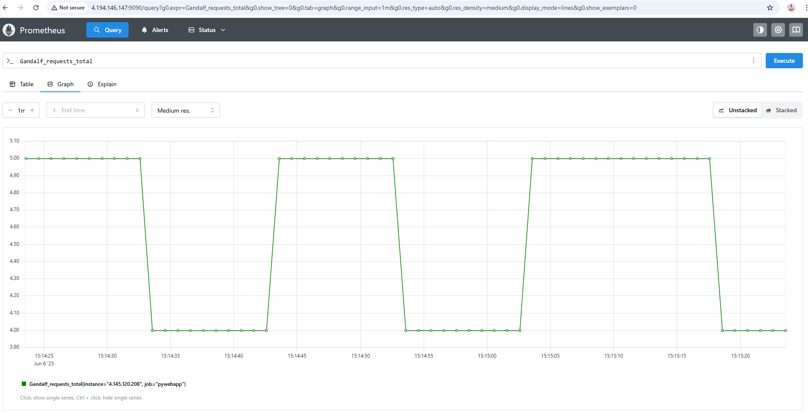
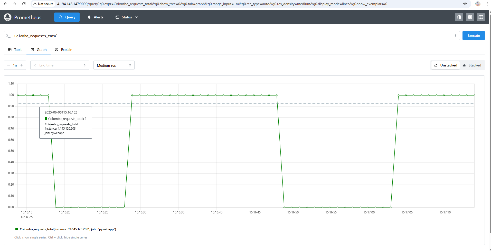

## Overview of the Project

This Repository Contains all the codes related Python Web Application it is deployment components. In the repository it has several sub folders. Purpose of those sub folders are shown in the below table

| Folder Name                             | Purpose                                                                                                                    |
|----------------------------------------|----------------------------------------------------------------------------------------------------------------------------|
| Ansible_playbooks_promethus_configuration | This folder contains the playbook used to install and configure Prometheus on a Linux virtual machine (Ubuntu assumed)    |
| Infrastrucuture                         | This folder contains Terraform scripts used to provision resources on Azure Cloud                                          |
| K8Manifests                             | This folder contains the Kubernetes manifests to deploy deployments and services                                            |
| static and templates                    | This folder contains static content (e.g., images) and templates (e.g., HTML) used by the Python web application           |

Ansible Playbooks,Infrastructure and K8Manifests has its own Readme.md file describing about its configuration. 

## Description about the application 

In the repository there is a python web application named as app.py.

To create this App Flask Framework has been used. There are two popular frameworks for developing python WebApps which are Django and Flask. Since Flask is light weight Flask has been chosen to develop the application.

Refer below documentation understand how to create Python Web Application 
    https://medium.com/@dattu1993/creating-a-web-application-with-python-a-comprehensive-guide-for-beginners-db59df5867e4 

To Understand Flaks its sub functions refer to flask documentation 
    https://flask.palletsprojects.com/en/stable/quickstart/ 

When flaks application is created by default it runs on port 5000 with accessible on localhost.

To use custom port and listen on all address (0.0.0.0) added below code block  as per below documentation

    if __name__ == "__main__":

        app.run('0.0.0.0', 8181)

    Documentation:  https://learn.microsoft.com/en-us/visualstudio/ide/quickstart-python?view=vs-2022  

By adding this applications was exposed on custom port and able to run without flaks. (Issue python3)

In the app.py it has commnents about each function usage for more informational purpose.

## Containerizing the Application 

Basic functionality of Applications as follows 

1. When Access application on the Colombo URL it shows the Colombo Time 
2. When Access gandalf URL it shows the image 
3. When Application Loads Gives an weclome message 
4. Access other URL gives error message of invalid path 

Once the logic has written for the above, we have containerized the application. 

Followed Below Documentations  which is specific to Python
    https://docs.docker.com/guides/python/develop/ 
    https://docs.docker.com/guides/python/containerize/

I used manually create assests method. I get the Example Docker file from above and modified with respective to my need.

When it comes to containerization need to specify dependencies in the requirements.txt file. In here specified packages which same as the version in local machine. So when the content is copied to the docker image and it starts installing the version same as my local machine. 

In Docker File below section install the dependencies.
    # Installing Dependenices
    RUN pip3 install -r requirements.txt 

To view Current Version of dependencies in my machine used below commands.

    1. Flask Version: flask --version
    2. Pytz Version: pip3 show pytz

__Build the Docker Image__

To Build the image use the below command.
        docker build -t roshanthamalaka/roshanassignemt_ac:v1 .
        docker pusj roshanthamalaka/roshanassignemt_ac:v1

As the Container Image Repository I have chosen docker hub. "roshanthamalaka/roshanassignemt_ac" is the public docker Hub Repository.

__Problem Identified in the application During Containarization__

When docker image was created. App was running but can't access externally. Reason because app was exposed like this
    if name == "main": 
        app.run('127.0.0.1', 8181)
Therefore chaged 127.0.0.1 to 0.0.0.0 so app will liste on all interfaces not just loopback.

## Adding Prometheus Exporter to the Application

For Get understanding of the prometheus referred to below documentation 
    https://betterstack.com/community/guides/monitoring/prometheus/

Promethus scrap metric at interval by default on /metric endpoints 

According to promethus official documentation depending on the language has different libaries available to create custom prometheus exporters. 
    https://prometheus.io/docs/instrumenting/clientlibs/ 

Since the application is python used below python libarary from the above. Python Library Documentation Below.
    https://prometheus.github.io/client_python

In above documentation under instrument section it shows that it publishes four type of metricses which are 
1. Counter
2. Gauage
3. Summary 
4. Histogram

For the purpose of count the request to specific URL implemented count metric

To use this need to install prometheus-client libary and import several components in that libarary 

This also added to requirements.txt file 

In the app.py we have specified counters like below 

    counter_gdlf = Counter("Gandalf_requests","Total Number of Request to /gandalf uri",registry=registry,) # metric Name will be Gandalf_requests_total because adding prefix
counter_clmb = Counter("Colombo_requests","Total Number of Request to /colombo uri",registry=registry,) 

Then each URL request increment the counter by one using inc. Refer below code snippet taken from the application 

    counter_gdlf.inc() # Increment Counter

__Export Metrics from the Application__ 

Once the metrics are the need to publish on /metrics path. So the prometheus node can scrap those metrics and visualize it graph format.

In the promethus official documentation it was not clear on how to publish metrics on /metrics path. Therefore reffered to below documentation. 

    https://betterstack.com/community/guides/monitoring/prometheus-python-metrics/#step-3-instrumenting-a-counter-metric 

To Publish metrics added below block 

    @app.route('/metrics')
    def metrics():
        # """ Exposes application metrics in a Prometheus-compatible format. """
      return generate_latest(), 200, {'Content-Type': CONTENT_TYPE_LATEST}

This Publish all the prometheus metrics. Only need to publish custom metrics therefore need to create registry and register the counters with custom registry.

In the App You can see Below Code Block which specify Custom Registry 

        registry = CollectorRegistry()

    Documentation https://betterstack.com/community/guides/monitoring/prometheus-python-metrics/#step-1-setting-up-the-demo-project:~:text=If%20you%20want%20to%20disable%20these%20and%20expose%20only%20specific%20metrics%2C%20you%20need%20to%20create%20a%20custom%20registry%3A 

Thats why Counter metrics defined like below. This will register counter with custom registry 

    counter_gdlf = Counter("Gandalf_total_requests","Total Number of Request to /gandalf uri",registry=registry,)

Then Modified the metrics function with registry like below. Therefore it will publish those custom metrics

    @app.route('/metrics')
    def metrics():
    return generate_latest(registry), 200, {'Content-Type': CONTENT_TYPE_LATEST}

## Hosting the Application 

To host the Application Azure kubernetes Service has been utilized.  Manifest used to create kubernetes component (app_deployment.yml) available in the K8Manifest Folder with Description.

In Summary deployment Kubernetes Deployment and LoadBalancer service. This will expose Application on static Public IP Address on Port 80. Refer below Screenshot taken from the application when running in Kurbernetes Cluster. 

Showing Colombo Time wghen path /colombo

Showing Gandalf Image When Path /gandalf

Showing Promethus Exporter Metrics when accessing /metrics URL 

Promethus Node has been setup to Scrap those metrics from the application. Refer below Screenshot taken from the Promethus node scraping each metric

Request to  Gandalf URL Visualize From Prometheus 

Request to Colombo URL Visualize From Prometheus

## Infrastructure Creation 

To Create AKS Cluster, Promethus VM on Azure use Terraform as the infrastrucutrue as Code Tool. Terraform scripts available at the Infrastructure Folder.

 Description about the terraform script available in the Readme file available there 

## Promethus Server Installation 

Followed Below Documentation to identify Manual Installation methods of the Promethus on Server.

    https://prometheus.io/docs/introduction/first_steps/

 Use Ansible to install and configure the prometheus server. Ansible Playbook availble in Ansible_playbooks_promethus_configuration folder.
 Readme file in that folder has description about  installation and configuration