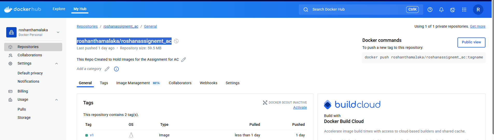

## Overview of the Project

This Repository Contains all the codes related Python Web Application it is deployment components. In the repository it has several sub folders. Purpose of those sub folders are shown in the below table

| Folder Name                             | Purpose                                                                                                                    |
|----------------------------------------|----------------------------------------------------------------------------------------------------------------------------|
| Ansible_playbooks_promethus_configuration | This folder contains the playbook used to install and configure Prometheus on a Linux virtual machine (Ubuntu assumed)    |
| Infrastrucuture                         | This folder contains Terraform scripts used to provision resources on Azure Cloud                                          |
| K8Manifests                             | This folder contains the Kubernetes manifests to deploy deployments and services                                            |
| static and templates                    | This folder contains static content (e.g., images) and templates (e.g., HTML) used by the Python web application           |

Ansible Playbooks,Infrastructure and K8Manifests has its own Readme.md file describing about its configuration. 

## Description about the application 

In the repository there is a python web application named as app.py.

To create this App Flask Framework has been used. There are two popular frameworks for developing python WebApps which are Django and Flask. Since Flask is light weight Flask has been chosen to develop the application.

Refer below documentation understand how to create Python Web Application 
https://medium.com/@dattu1993/creating-a-web-application-with-python-a-comprehensive-guide-for-beginners-db59df5867e4 

To Understand Flaks its sub functions refer to flask documentation 
https://flask.palletsprojects.com/en/stable/quickstart/ 

When flaks application is created by default it runs on port 5000 with accessible on localhost.

To use custom port and listen on all address (0.0.0.0) added below code block  as per below documentation

    if __name__ == "__main__":

        app.run('0.0.0.0', 8181)

Documentation:  https://learn.microsoft.com/en-us/visualstudio/ide/quickstart-python?view=vs-2022  

By adding this applications was exposed on custom port and able to run without flaks. (Issue python3)

In the app.py it has commnents about each function usage for more informational purpose.

## Containerizing the Application 

Basic functionality of Applications as follows 

1. When Access application on the Colombo URL it shows the Colombo Time 
2. When Access gandalf URL it shows the image 
3. When Application Loads Gives an weclome message 
4. Access other URL gives error message of invalid path 

Once the logic has written for the above, we have containerized the application. 

Followed Below Documentations  which is specific to Python
https://docs.docker.com/guides/python/develop/ 
https://docs.docker.com/guides/python/containerize/

I used manually create assests method. I get the Example Docker file from above and modified with respective to my need.

When it comes to containerization need to specify dependencies in the requirements.txt file. In here specified packages which same as the version in local machine. So when the content is copied to the docker image and it starts installing the version same as my local machine. 

In Docker File below section install the dependencies.
    # Installing Dependenices
    RUN pip3 install -r requirements.txt 

To view Current Version of dependencies in my machine used below commands

    1. Flask Version: flask --version
    2. Pytz Version: pip3 show pytz

___Build the Docker Image__

To Build the image use the below command.
        docker build -t roshanthamalaka/roshanassignemt_ac:v1 .
        docker pusj roshanthamalaka/roshanassignemt_ac:v1

As the Container Image Repository I have chosen docker hub. "roshanthamalaka/roshanassignemt_ac" is the public docker Hub Repository.
